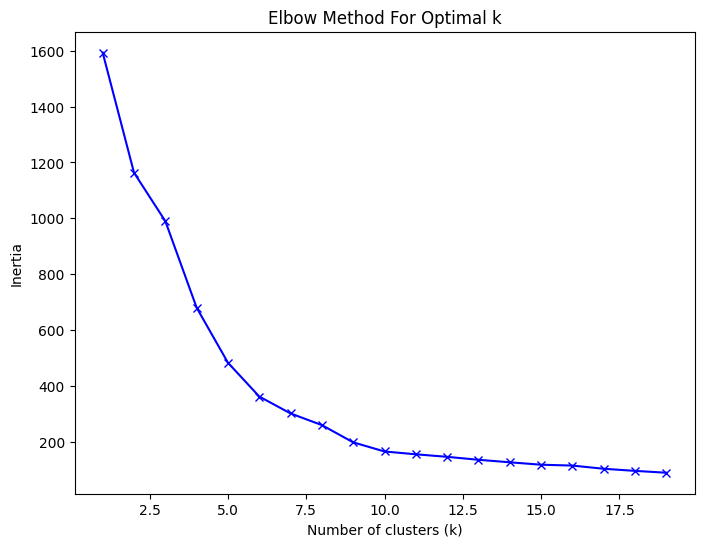
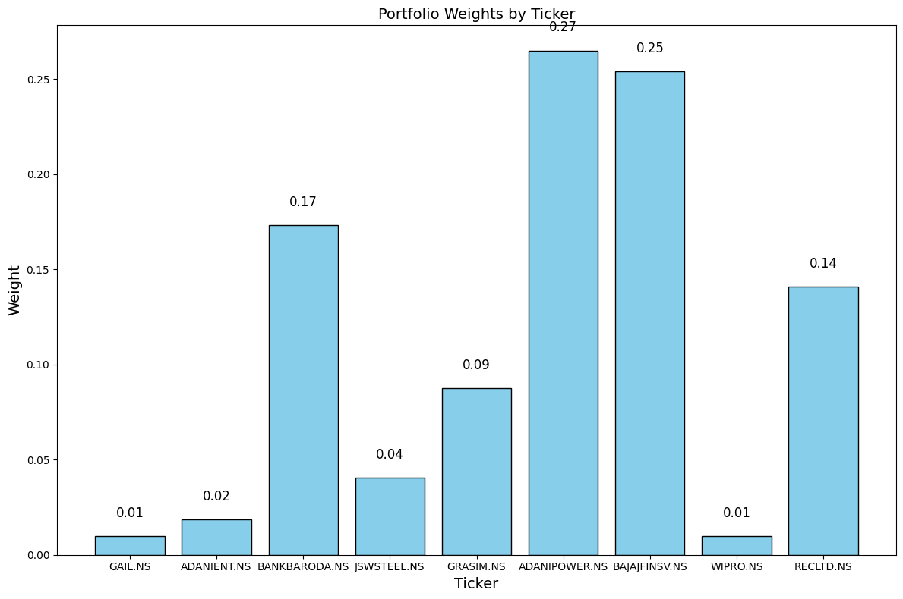

# README

## **Nifty 200 Stock Analysis Using K-Means Clustering**

### **Project Overview**
This project analyzes stocks listed in the Nifty 200 index using machine learning techniques and financial metrics. The primary objective is to assist investors in making informed decisions by grouping stocks into clusters based on key financial factors and evaluating their performance using metrics like Sharpe Ratio, Treynor Ratio, Reward-to-Risk Ratio, and Value at Risk (VaR).

### **Data Collection**
- **Source**: Financial data for Nifty 200 companies was collected using APIs like Yahoo Finance and other sources.
- **Metrics Used**:
  - Beta
  - Price-to-Earnings (P/E) Ratio
  - Price-to-Book (P/B) Ratio
  - Market Capitalization
  - 52-Week High and Low
  - Return on Equity (ROE)
  - Debt-to-Equity Ratio
- **Preprocessing**:
  - Missing values were handled by dropping incomplete records.
  - Data was standardized to ensure consistency in clustering and analysis.

### **Analysis Steps**

#### **1. K-Means Clustering**
- Used Elbow Method to determine the optimal number of clusters, which was found to be 10.
- Grouped stocks into clusters based on their financial metrics.
- Interpreted the characteristics of each cluster, identifying themes such as growth stocks, value stocks, and high-leverage firms.
  

#### **2. Portfolio Performance Metrics**
For each cluster, the following metrics were computed:
- **Return-to-Risk Ratio**: Measures the portfolio's efficiency in generating returns relative to risk.
- **Sharpe Ratio**: Evaluates risk-adjusted returns using the 10-year Indian Government Bond yield (6.796%) as the risk-free rate.
- **Treynor Ratio**: Assesses performance relative to systematic risk (beta).

#### **3. Value at Risk (VaR)**
- Calculated at a 95% confidence level to estimate the potential loss in adverse market conditions.

#### **4. Sub-Cluster Analysis**
- Identified the best-performing cluster (Cluster 6) based on metrics.
- Performed further analysis to shortlist stocks within Cluster 6 using historical returns (1-year, 6-month, and 3-month periods).
- Optimized portfolio weights for the final recommendation.

### **Results**
#### **Cluster Insights**
- Clusters were analyzed for returns, volatility, and risk-adjusted performance.
- Cluster 6 emerged as the most efficient portfolio with:
  - High return (28.00%)
  - Low volatility (16.91%)
  - Highest Sharpe Ratio (0.0790)
  - Best Reward-to-Risk Ratio (0.1043)
  - Highest Treynor Ratio (0.0008)

#### **Portfolio Optimization**
- Sub-clustering within Cluster 6 resulted in a final portfolio of 9 stocks:
  - Stocks: GAIL.NS, ADANIENT.NS, BANKBARODA.NS, JSWSTEEL.NS, GRASIM.NS, ADANIPOWER.NS, BAJAJFINSIV.NS, WIPRO.NS, RECLTD.NS.
  - Weight allocations were determined based on historical returns, ensuring a diversified and efficient portfolio.

#### **Comparison with Nifty 200 Benchmark**
- The selected portfolio outperformed the Nifty 200 in terms of return, Sharpe Ratio, and Treynor Ratio.

  

### **Methodology**
1. **Data Loading and Preprocessing**:
   - Collected data from CSV files and APIs.
   - Standardized metrics for uniformity.
2. **Clustering**:
   - Performed K-Means clustering on standardized data.
   - Visualized cluster characteristics and performance metrics.
3. **Portfolio Analysis**:
   - Computed returns, volatility, Sharpe Ratio, and Treynor Ratio for each cluster.
   - Identified the best-performing cluster based on combined metrics.
4. **Optimization**:
   - Used Markowitz's Modern Portfolio Theory to compute optimal weights.
   - Consolidated weights for different time periods (1 year, 6 months, 3 months).

### **How to Run the Code**
1. **Dependencies**:
   - Python Libraries: `numpy`, `pandas`, `matplotlib`, `scipy`, `sklearn`, `yfinance`
2. **Steps**:
   - Clone the repository.
   - Install required libraries: `pip install -r requirements.txt`.
   - Run the notebook or scripts to perform clustering and portfolio analysis.

### **Key Files**
- `project_1.ipynb`: Jupyter notebook containing the code for data analysis, clustering, and portfolio optimization.
- `nifty_200_clusters.csv`: Cluster assignments for each stock.
- `nifty_200_fundamentals.csv`: Financial metrics, including beta, for each stock.
- `cluster_daily_returns.csv`: Daily returns for each cluster.
- `optimal_weights_combined.csv`: Optimized portfolio weights for 1 year, 6 months, and 3 months.

### **Conclusion**
- This project demonstrates how machine learning and financial metrics can guide portfolio optimization.
- The final portfolio is well-diversified and efficient, suitable for medium to long-term investment.

### **Future Work**
- Incorporate additional financial metrics for a more comprehensive analysis.
- Explore dynamic clustering techniques to adapt to changing market conditions.
- Extend the analysis to other indices or sectors.

